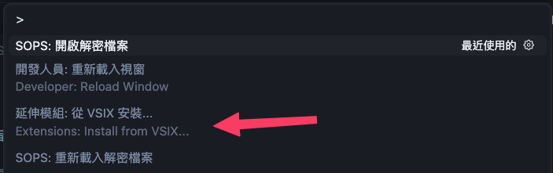
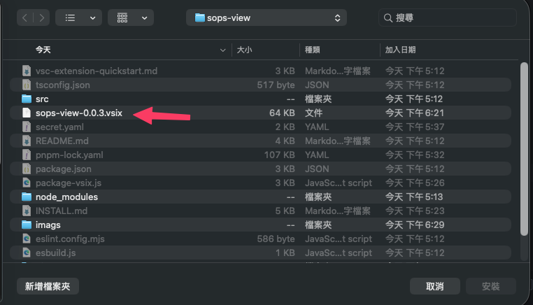
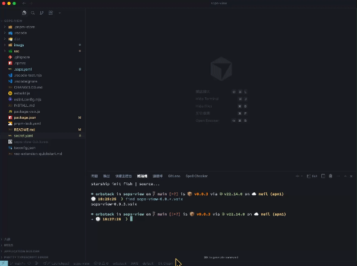

# SOPS View

一個 VSCode 擴充功能，讓您可以直接在編輯器中查看和編輯使用 SOPS 加密的檔案。當您點擊加密檔案時，擴充功能會自動解密並顯示內容，讓您可以輕鬆編輯。

## 功能特色

- 🔓 **自動解密顯示**：點擊 SOPS 加密檔案時，自動解密並顯示內容
- ✏️ **直接編輯**：編輯解密後的內容，儲存時自動加密並寫回原始檔案
- ⚙️ **自動配置偵測**：自動尋找專案中的 `.sops.yaml` 配置檔案
- 🔐 **AWS KMS 支援**：自動根據 KMS ARN 判斷 AWS Account ID，並使用對應的 AWS Profile
- 🎯 **自訂檔案模式**：可自訂需要解密的檔案名稱模式

## 安裝

詳細的安裝說明請參考 [INSTALL.md](./INSTALL.md)

### 快速開始（開發模式）

1. 安裝依賴：`pnpm install`
2. 編譯擴充功能：`pnpm run compile`
3. 按 `F5` 啟動擴充功能開發主機進行測試

### 打包安裝

1. 打包：`pnpm run package && pnpm run package:vsix`
2. 在 VSCode 中安裝：`Extensions: Install from VSIX...`，然後選擇生成的 `.vsix` 檔案

## 需求

- [SOPS](https://github.com/getsops/sops) 必須已安裝並可在 PATH 中使用
- 如果使用 AWS KMS，需要配置好 AWS 憑證

## 擴充功能設定

此擴充功能提供以下設定選項：

### `sopsView.filePatterns`

檔案名稱模式列表，用於識別需要解密的 SOPS 加密檔案（支援 glob 模式）。

**預設值：**
```json
[
  "*.encrypted.yaml",
  "*.encrypted.yml",
  "*.sops.yaml",
  "*.sops.yml",
  "secrets.yaml",
  "secrets.yml"
]
```

**範例：**
```json
{
  "sopsView.filePatterns": [
    "*.encrypted.yaml",
    "secrets/**/*.yaml"
  ]
}
```

### `sopsView.awsAccountProfileMapping`

AWS Account ID 到 AWS Profile 名稱的映射。當使用 AWS KMS 加密時，擴充功能會從 KMS ARN 中提取 Account ID，然後使用對應的 AWS Profile。

**預設值：** `{}`

**範例：**
```json
{
  "sopsView.awsAccountProfileMapping": {
    "123456789012": "prod-profile",
    "987654321098": "dev-profile"
  }
}
```

### `sopsView.sopsExecutablePath`

SOPS 可執行檔的路徑。如果 sops 在 PATH 中，可以使用 `"sops"`。

**預設值：** `"sops"`

**範例：**
```json
{
  "sopsView.sopsExecutablePath": "/usr/local/bin/sops"
}
```

## 使用方式

### 自動開啟

當您在檔案總管中點擊符合模式的 SOPS 加密檔案時，擴充功能會自動：
1. 偵測檔案是否符合配置的模式
2. 尋找專案中的 `.sops.yaml` 配置
3. 解析 KMS ARN 並確定對應的 AWS Profile（如果適用）
4. 解密檔案並在新分頁中顯示

### 手動開啟

您也可以使用命令面板（`Cmd+Shift+P` / `Ctrl+Shift+P`）執行以下命令：

- **SOPS: 開啟解密檔案**：手動開啟當前檔案的解密版本
- **SOPS: 重新載入解密檔案**：重新載入當前開啟的解密檔案

### 編輯和儲存

1. 在解密後的檔案中進行編輯
2. 儲存檔案（`Cmd+S` / `Ctrl+S`）
3. 擴充功能會自動：
   - 使用相同的加密配置加密內容
   - 寫回原始加密檔案
   - 顯示成功訊息

## 工作原理

1. **檔案匹配**：擴充功能根據配置的檔案名稱模式識別 SOPS 加密檔案
2. **配置偵測**：從專案根目錄向上搜尋 `.sops.yaml` 配置檔案
3. **KMS ARN 解析**：從 `.sops.yaml` 中的 `creation_rules` 提取 KMS ARN，並解析出 AWS Account ID
4. **Profile 映射**：根據 Account ID 查找對應的 AWS Profile，並設定 `AWS_PROFILE` 環境變數
5. **解密/加密**：使用 SOPS 命令解密或加密檔案內容

## 已知問題

- 如果 SOPS 命令執行失敗，會顯示錯誤訊息
- 確保 SOPS 已正確安裝並可在終端機中執行
- 如果使用 AWS KMS，確保對應的 AWS Profile 已正確配置

## 發布說明

### 0.0.2

初始版本：
- 自動解密顯示 SOPS 加密檔案
- 支援直接編輯和自動加密儲存
- 自動偵測 `.sops.yaml` 配置
- 支援 AWS KMS ARN 到 Account ID 的映射
- 可自訂檔案名稱模式

---

## 遵循擴充功能指南

確保您已閱讀並遵循 [擴充功能指南](https://code.visualstudio.com/api/references/extension-guidelines)。

----
## 自動發版

專案已配置 GitHub Actions workflow 來自動進行發版：

### 使用方式

1. **手動觸發發版**：
   - 前往 GitHub Actions 頁面
   - 選擇 "Release" workflow
   - 點擊 "Run workflow"
   - 輸入版本號（例如：`0.0.4`，不需要 `v` 前綴）
   - Workflow 會自動：
     - 更新 `package.json` 中的版本號
     - Commit 變更到 main 分支
     - 建立並推送版本標籤（例如：`v0.0.4`）
     - 編譯並打包擴充功能
     - 建立 GitHub Release 並上傳 `.vsix` 檔案

2. **透過標籤觸發**：
   - 手動建立並推送版本標籤（例如：`git tag v0.0.4 && git push origin v0.0.4`）
   - Workflow 會自動編譯、打包並建立 GitHub Release

### Workflow 檔案位置

`.github/workflows/release.yml`

---

## Install local build and Install to Vscode or Cursor
1. 
```bash
[optional]: npm i -g pnpm
pnpm install
pnpm run compile && node package-vsix.js

find sops-view-0.0.*.vsix
```

2. Open `Cursor/VsCode`
  - Command + Shift + P > Extensions: install from VSIX
  
  
  - 🚨 Command + Shift + P > Developer: Reload Window 🚨
3. Setting AWS_PROFILE mapping  `sopsView.awsAccountProfileMapping`
AWS Account ID 到 AWS Profile 名稱的映射。當使用 AWS KMS 加密時，擴充功能會從 KMS ARN 中提取 Account ID，然後使用對應的 AWS Profile。
**範例：**
```json
{
  "sopsView.awsAccountProfileMapping": {
    "123456789012": "prod-profile",
    "987654321098": "dev-profile"
  }
}
```
4. Have fun.
